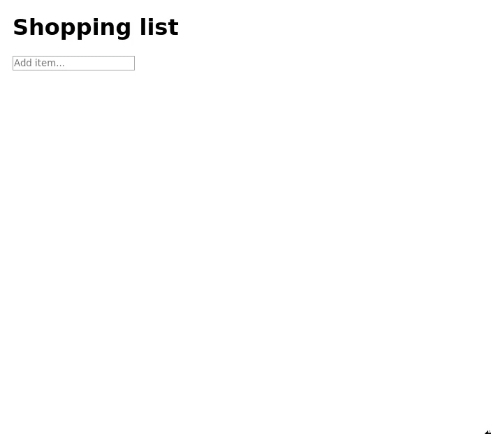

# Shopping list web application

The aim of project is to create a shopping list application.
The requirements are as follows:

- [X] View a list of items on a shopping list
- [X] Add items to the shopping list
- [X] Remove items from the shopping list
- [X] Ability to cross purchased items off the list
- [X] Persist the data
- [X] Change the order of items on the list
- [ ] Use an API to fetch prices on the list
- [ ] Display the total cost of the items
- [ ] Set a spending limit and alert if exceeded
- [ ] Share list via email
- [ ] Add user authentication and authorisation

I am planning on spending a total of 6 hours on the project and I am aiming to complete the first 6 tasks in that time

## How to run
Start PostgreSQL database:
```console
docker-compose up
```

Follow instructions in backend and frontend README files

Here is an example of the application in operation:

